The λGT Language．

[toc]

私の研究テーマの紹介をしたい．

私はプログラミング言語の研究をしている．

プログラミング言語の研究はもちろん山程あるが，
私の研究のどこが新しいのかというと，
**「（ちょっと）複雑なデータ構造も宣言的に型安全に扱える」**
ということ．

これだけだと抽象的すぎるので，具体例で説明したい．

まずは，「普通の・既存の言語ではデータ構造をどう扱うか？」について考えてみる．

## データ構造の型定義

まずは一番簡単なデータ構造の例として，「リスト」について考える．


---

まずはどう定義するかを見ていく．

C/C++ や Java などの命令型言語
（Java はオブジェクト指向だが，今考えている範疇だと命令型言語と思って良いはず）では，
こんな感じにノードを定義することになる．

```c
/* Define the node structure */
typedef struct Node {
    int data; /* リストの要素 */
    struct Node *next; /* 次のノードへのポインタ */
} Node;
```

---

OCaml や Haskell などの関数型言語だと，
もっと綺麗に定義ができる．

> ※ そもそも何をもって「関数型言語」と呼ぶかがかなりややこしいが，
> ここでは OCaml や Haskell などの，
>
> - 静的型付きで，
> - 関数を関数の入出力として扱えて（そしてそれが普通で），
> - パターンマッチングとかがある
>
> 言語のことを指すことにしたい．
> つまり，Lisp とかではない．

例えば

```ocaml
type list = Nil | Cons of int * list
```

はリストを定義している．

これは，
リストは

- 「空のリスト（`Nil`）」か
- 「要素（整数）と後続のリストの組（`int * list`）」

のどちらかだと言うことを示している．

## データ構造の操作

C/C++ や Java などの命令型言語ではポインタ・参照を駆使してデータ構造を扱うことになる．

例えばリストの要素を全て `+ 1` したいときは，こんな感じになる．

```c
/* 各要素を +1 */
void increment_list(Node *head) {
    while (head != NULL) {
        head->data += 1;
        head = head->next;
    }
}
```

---

関数型言語ではこのようなデータ構造の操作を「パターンマッチング」で宣言的に記述することができる．

例えばリストの要素を全て `+ 1` したいときは，

```ocaml
let rec f xs = match xs with
  Nil -> Nil
| Cons (y, ys) -> Cons (y + 1, f ys)
  (* y は要素, ys は後続のリスト *)
```

のように書ける．

そもそもリストは

- 「空のリスト（`Nil`）」か
- 「要素（整数）と後続のリストの組（`int * list`）」

であると定義したので，
それに従ってパターンマッチングで分解しているだけ．

わかりやすい！

ここでは，これを「宣言的に書ける」と言うことにする．

> ※ 関数型言語では map 関数を使ってもっと簡単に書ける．今回の例は
>
> ```ocaml
> let f = map succ
> (* succ は Pervasives に定義されている関数 (fun x -> x + 1). *)
> ```
>
> だけで書ける．
>
> ただここではデータ構造を直接操作するプログラムについて考えたいので，
> そのような例になっている．
>
> map 関数を使う前提だとしても，
> map 関数自体は上記のようにパターンマッチングを使って書かれており，
> この議論が同様に成り立つ．

---

関数型言語では，
定義に沿ってパターンマッチングで分解して，
分解して得られるものに対して網羅的に操作を定義しているので，
変なところで変なこと（未定義動作を引き起こしたり，止まったり）を起こさないということが保証できる．

---

関数型言語は，
型定義も綺麗だし，
実際の操作も宣言的に書けるし，
型安全だし，
すごく良い感じ．

実際，Rust などの比較的新しい言語は，こうしたいわゆる関数型言語の特徴をどんどん取り込んでいる．

## 問題

リストやツリーなどのシンプルなデータ構造であれば，
関数型言語では綺麗に型定義して宣言的かつ型安全に操作ができる．

ただし，一般に「データ構造」と言ったときに，
素朴なリストやツリーだけしかないかと言われると，そうではない．

---

例えば双方向連結リストとか，かなりよく使われる．


他にもスキップリストや


葉が接続されたツリーなど，


色んなデータ構造があり得る．

---

残念ながら，既存のプログラミング言語ではそもそもこういうデータ構造の型を定義することからできない．

例えば，
双方向連結リストを構成する「ノードの型」とか，
双方向連結リストの「操作のインタフェース」を定義することはできるが．
そもそもの双方向連結リストの形状をちゃんと定義することが，できない．

---

例えば C/C++ で以下のように双方向連結リストの「ノードの型」を定義したとする．

```c
/* Define the node structure */
typedef struct Node {
    int data; /* リストの要素 */
    struct Node *prev; /* 前のノードへのポインタ */
    struct Node *next; /* 次のノードへのポインタ */
} Node;
```

これは正しい定義ではあるのだが，
「この型定義に従うものが双方向連結リストに必ずなる」という保証はない．

例えば，以下の図のように，
「`prev` が一つ前のノードではなく，自分自身を参照してしまっている」
などのバグがあっても既存の型チェックでは発見できない．



上記のようになっていると，
「`prev` を辿って先頭の要素まで逆順に取得していこうとした際に無限ループする」
などの，
厄介なバグを引き起こす．

残念ながらポインタ・参照を操作していると，
こういうバグは頻出する．

---

関数型言語では (raw) ポインタではなく，
「参照」を用いて上記のようなデータ構造を定義し，
操作することになるのだが，
いずれにせよ同様の問題が発生する．

---

個人的には，このように，

> リッチなデータ構造の操作は煩雑で誤りやすい．
> なのにそれらの操作が正しいか（変なデータ構造になっていたりしないか）のチェックはできない．

というのは残念な状況であり，解決されるべき課題だと考えている．

## 目指すもの

私がやりたいのは，
**「（ちょっと）複雑なデータ構造も宣言的に型安全に扱える」**
ということ．

例えば双方向連結リストやスキップリスト，葉が繋がったツリーなどの，
素朴なリストやツリーではないようなデータ構造であっても，
既存の関数型言語が素朴なリストやツリーを扱うように，
帰納的に型定義してパターンマッチングによる操作ができるようにしたい．

そこで，まず上記データ構造を全て包含する「（ポートハイパー）グラフ」
をパターンマッチングで宣言的に操作できる言語を設計した．

これが表題にもある私の言語 $\lambda_{GT}$ (Lambda GT) である．

- Lambda Calculus と Graph Transformation (グラフのパターンマッチングと書き換え) に由来している．

---

$\lambda_{GT}$ では，例えばこのようなデータ構造を扱うことができる．


---

このデータ構造は以下のような再帰的定義によって厳密に型定義できる．


---

このようなデータ構造へのパターンマッチングを行うプログラムは以下のように記述できる．


---

上記プログラムは以下のように動作する．


---

まずそもそも木よりもちょっと複雑なデータ構造であっても，その型を定義できるようにして，
そのようなデータ構造を関数型ライクにパターンマッチングで取り扱うと言うこと．

より複雑なデータ構造として「一般のグラフ」もあり得る．

より具体的には，新しい言語（機能）を作っている．

## 余談

勉強不足，頭脳不足，体力不足は常に感じている．
才能があって研究にフルコミットしている人を尻目に，本業とは別に社会人博士を進めるのは能力的・時間的・体力的・精神的にあんまり現実的ではないなという気はする．
あと学生のときにもっと勉強しておくべきだった（「するべきだった」とは思わない．時間が戻ってもやらなさそうだし）．

関数型言語のプログラムの良いところ：

- 代入操作（破壊的更新）をしていない．
  - このプログラムは，パターンマッチングをしながら再帰的に **新しいリストを定義** しているだけ．
  - 破壊的更新をすると，
    ちょっと１行だけ目を離した隙に全然違う値になってるとかいうことが起こり得て，
    プログラムの挙動を追うのが大変になる．
  - なので，破壊的更新せずともプログラムが書けるのは一般にプログラマにとって嬉しい[^1]．
- 型安全である．
  - C/C++ 言語の例では
- 煩雑なポインタ操作もない．

つまり，型安全である．

対して，C/C++ などの言語は型安全でなく，
容易に未定義動作を引き起こしうる．
Java は（ある種）型安全と言えば型安全だが，
いつ Null が返ってくるか分からない．

---
