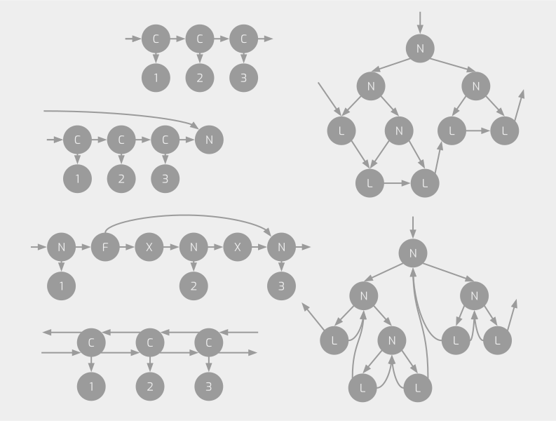

I am interested in the design and implementation of programming languages.
Currently, I am creating a new language named \\(\lambda\_{GT}\\).

Here is a list of topics that I am into.

- Functional language
- Type system
- Software verification
- Graph transformation

# \\(\lambda\_{GT}\\): A purely functional language that can handle graphs as first-class data

Graphs are a generalized concept that encompasses more complex data structures than trees,
such as difference lists, doubly-linked lists, skip lists, and leaf-linked trees.

Normally, these structures are handled with destructive assignments to heaps,
which is opposed to a purely functional programming style and makes verification difficult.

We propose a new
purely functional language, \\(\lambda\_{GT}\\), that handles graphs as immutable,
first-class data structures with a pattern matching mechanism
based on Graph Transformation and developed a new type system, \\(F\_{GT}\\), for the language.

Our approach is in contrast with the analysis of pointer manipulation programs
using separation logic, shape analysis, etc. in that
(i) we do not consider destructive operations
but pattern matchings over graphs provided by the new higher-level language that
abstract pointers and heaps away and that
(ii) we pursue what properties can be established automatically using a rather simple typing framework.

## Publications

- 2022

  1. ([arXiv](https://arxiv.org/abs/2209.05149),
     [slide](./materials/pro2022.pdf))
     Type checking data structures more complex than tree,
     to be appeared in Journal of Information Processing, 2022 (19pp. **referred**).
     

Abstract

       Graphs are a generalized concept that encompasses more complex data structures than trees,
       such as difference lists, doubly-linked lists, skip lists, and leaf-linked trees.
       Normally, these structures are handled with destructive assignments to heaps,
       which is opposed to a purely functional programming style and makes verification difficult.
       We propose a new
       purely functional language, \\(\lambda_{GT}\\), that handles graphs as immutable,
       first-class data structures with a pattern matching mechanism
       based on Graph Transformation and developed a new type system, \\(F_{GT}\\), for the language.
       Our approach is in contrast with the analysis of pointer manipulation programs
       using separation logic, shape analysis, etc. in that
       (i) we do not consider destructive operations
       but pattern matchings over graphs provided by the new higher-level language that
       abstract pointers and heaps away and that
       (ii) we pursue what properties can be established automatically using a rather simple typing framework.
     

  2. ([pdf](http://jssst.or.jp/files/user/taikai/2022/papers/20-L.pdf),
     [slide](./materials/jssst2022.pdf))
     A functional language with graphs as first-class data,
     In Proc. The 39th JSSST Annual Conference, 2022,
     [**Presentation Award**](https://jssst2022.wordpress.com/).
     (15pp. unreferred).
     

Abstract

       Graphs are a generalized concept that encompasses more complex data structures than trees,
       such as difference lists, doubly-linked lists, skip lists, and leaf-linked trees. Normally, these structures are handled
       with destructive assignments to heaps, as opposed to a purely functional programming style. We proposed
       a new purely functional language, λGT, that handles graphs as immutable, first-class data structures with
       a pattern matching mechanism based on Graph Transformation. Since graphs can be more complex than
       trees and require non-trivial formalism, the implementation of the language is also more complicated than
       ordinary functional languages. λGT is even more advanced than the ordinary graph transformation systems.
       We implemented a reference interpreter, a reference implementation of the language. We believe this
       is usable for further investigation, including in the design of real languages based on λGT. The interpreter
       is written in only 500 lines of OCaml code.
     

     - [source code (github)](https://github.com/sano-jin/lambda-gt-alpha/)

# HyperLMNtal: A syntax-directed hypergraph transformation formalizm

The general definition of a hypergraph in graph transformation formalizms consists of
a vertex set, an edge set, vertex-to-edge correspondences, labeling functions, etc.,
and matchings and rewritings of subgraphs are defined using a morphism with these sets.

This is opposed to a syntax-driven semantics like those of \\(\lambda\\)-calculus or \\(\pi\\)-calculus.

We propose a new syntax-driven semantics for hypergraph transformation
by incorporating the syntax and semantics of name hiding
in process algebra into Flat LMNtal, a (non-hyper)graph transformation formalizm.

We also prove several properties on this and confirm its validity.

## Publications

- 2021
  1. ([pdf](http://jssst.or.jp/files/user/taikai/2021/papers/45-L.pdf),
     [slide](./materials/jssst2021.pdf))
     Introducing a syntax-driven and compositional syntax and semantics to hypergraph rewriting system,
     In Proc. The 38th JSSST Annual Conference, 2021,
     [**Student Encouragement Award**](https://jssst2021.wordpress.com/).
     (in Japanese, 9pp. unreferred).
     - ハイパーグラフ書き換え系への構文駆動で compositional な構文・意味論の提案．
     

概要

       グラフ書換え系における一般的なハイパーグラフの定義は，頂点集合，辺集合，頂点から辺への対応とラベリング
       関数などからなり，サブグラフへのマッチングや生成はそれらへの射を用いて定義される．ただし，これは λ 計算
       や π 計算のように構文駆動な意味論とは言い難い．そこで，本研究ではグラフ書き換えに基づく計算モデル Flat
       LMNtal にプロセス代数における名前の隠蔽の構文・意味論を組み込むことで，ハイパーグラフ書き換え系の構文駆
       動で compositional な構文・意味論を提案する．また，さらにこの上でいくつかの性質について証明を行い，その
       妥当性を確認した．
     

- 2020
  1. ([arXiv](https://arxiv.org/abs/2103.14698))
     Implementing G-Machine in HyperLMNtal, Bachelor thesis, 2020.
     

Abstract

       Since language processing systems generally allocate/discard memory with complex reference relationships,
       including circular and indirect references,
       their implementation is often not trivial.
       Here, the allocated memory and the references can be abstracted to the labeled vertices and edges of a graph.
       And there exists a graph rewriting language,
       a programming language or a calculation model that can handle graph intuitively,
       safely and efficiently.
       Therefore, 
       the implementation of a language processing system can be highly expected as an application field of graph rewriting language.
       To show this, in this research,
       we implemented G-machine, the virtual machine for lazy evaluation,
       in hypergraph rewriting language, HyperLMNtal.
     

